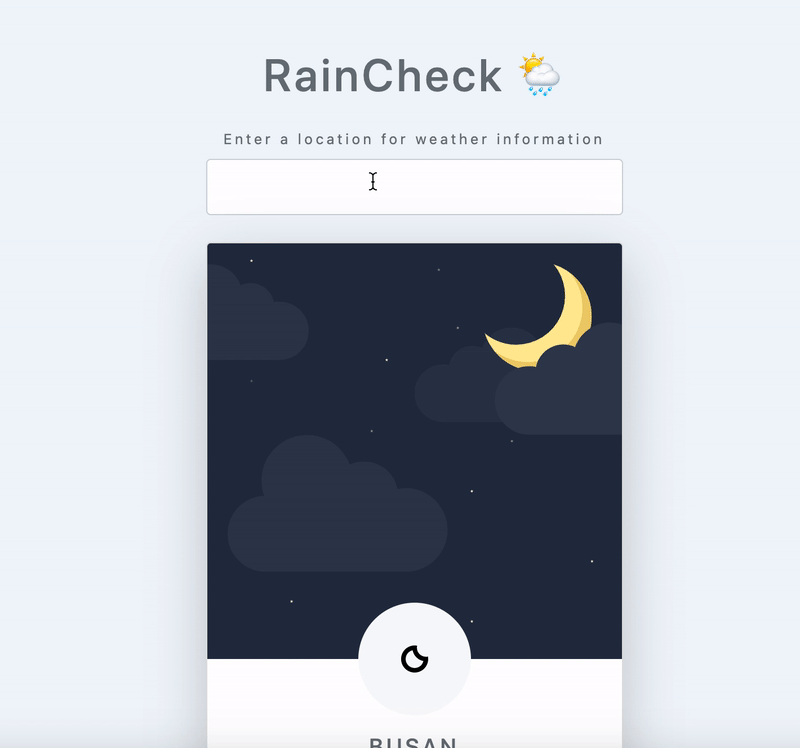

# Rain Check

A weather app that shows the current temperature, weather and a simple five-day forecast for a city.

## :umbrella: Features

- Built with JavaScript
- Weather data from the AccuWeather API



## :wrench: Installation

Clone this repo and open in VS Code.

The API requires a key from AccuWeather. In /scripts, create a config.js file.

```bash
touch config.js
```

```bash
const configKey = "key_lives_here";
```

Limitations: the AccuWeather API allows 50 requests per day. When that's met, delete the app from AccuWeather and create a new app, updating the API key in the config file.

To run: in index.html, right-click and select 'open with Live Server' (requires Live Server extension for VS Code). The app will run in the browser on port:5500
